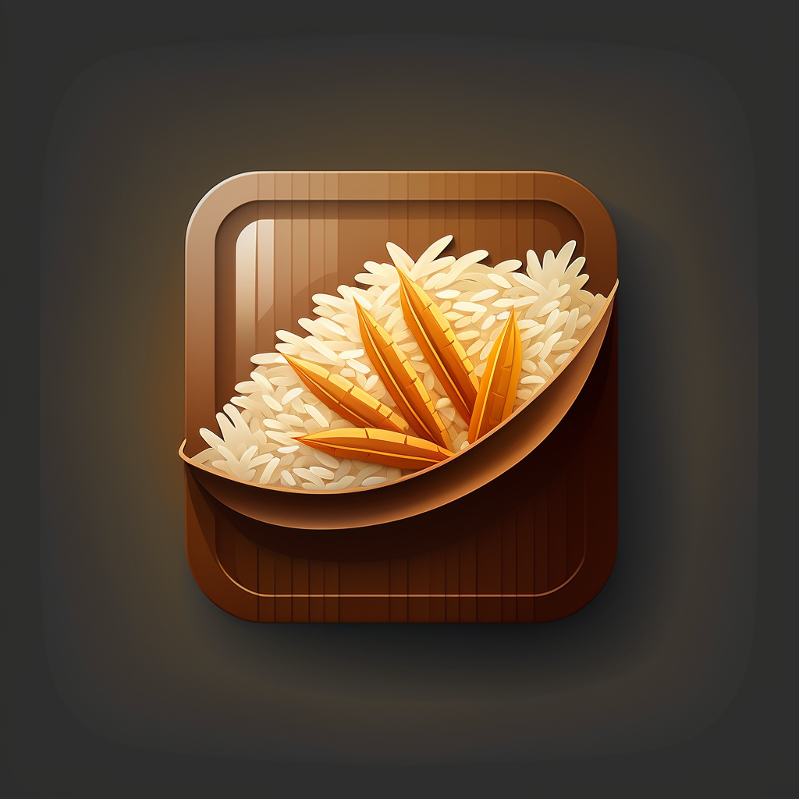

<div align="center">
    
    <br>
    <br>
    <b><i>strong, free and open source UCI chess engine written in C++.</i></b>
    <br>
    <br>
    
    <a href="./LICENSE">
    
    
</div>

## Overview
Rice is a powerful NNUE chess engine that combines the use of alpha-beta search with various other search techniques to achieve its impressive performance.

## Features

### Board Representation
* Bitboards
* Fancy magics for movegen

### Search

* Negamax
* Alpha beta pruning
* Quiescence search
* Null move pruning (NMP)
* Static null move pruning aka Reverse Futility Pruning
* PVS (Principal Variation Search)
* ZWS (Zero Window Search)
* LMR (Late Move Reduction)
* SEE Pruning (Static Exchange Evaluation Pruning)
* Movecount Pruning/LMP (Late Move Pruning)
* Transposition Table cutoffs and move ordering
* History, killers and MVVLVA Move ordering
* Search Extensions

### Evaluation
* NNUE (Efficiently updateable neural network)
* Net Architecture: 768 inputs with 4 buckets, 1 hidden layer of 768 size, perspective aware.
* NNUE Trainer: <a href="https://github.com/Luecx/Grapheus">Grapheus</a> by <a href="https://github.com/Luecx/">Luecx</a>
* Old trainer: <a href="https://github.com/dsekercioglu/marlinflow">marlinflow</a>

## Building
Default build (g++):

```bash
git clone https://github.com/rafid-dev/rice
cd rice/src
make 
./Rice
```

Clang build:
```bash
git clone https://github.com/rafid-dev/rice
cd rice/src
make CXX=clang++
./Rice
```

## Usage
The Universal Chess Interface (UCI) is a standard protocol used to communicate with
a chess engine, and is the recommended way to do so for typical graphical user interfaces
(GUI) or chess tools. Rice requires a <a href="https://www.chessprogramming.org/UCI#GUIs">UCI-compatible graphical user interface</a> in order to be used with the protocol.

## NNUE Background
From 5.0, Rice has switched to NNUE from its handcrafted evaluation.

When I lack the hardware resources to generate enough training data, I need to use data generated by external engines. However, I think it's important to be transparent about the use of these engines and where the training data comes from.

### <a href="https://github.com/cosmobobak/viridithas/"> Viridithas by Cosmo
Rice 5.0 has used data generated by Viridithas, a strong chess engine by Cosmo.

### <a href="https://lczero.org"> Leela Chess Zero </a> by the Lc0 Team
LC0 employs a novel method for playing high-level chess by utilizing MCTS and acquiring its chess knowledge through self-play. As Rice 6.0 and onwards utilizes data from LC0, it is worth noting that this data is licensed under the Open Database License, which promotes the sharing and reuse of data while maintaining legal protection for contributors and users.

## Special thanks to:
* <a href="https://github.com/AndyGrant"> Andrew Grant </a>, author of <a href="https://github.com/AndyGrant/Ethereal/">Ethereal</a> for his clear and concise code which led to better understanding. I also thank him for contributing threads for the development of Rice.
* <a href="https://github.com/Disservin">Disservin</a>, author of <a href="https://github.com/Disservin/Smallbrain">Smallbrain</a> for his <a href="https://github.com/Disservin/chess-library">chess library in c++</a> which is used in Rice.
* <a href="https://github.com/Luecx/">Luecx</a>, author of <a href="https://github.com/Luecx/Koivisto/">Koivisto</a> for his enormous help for implementation of NNUE
* <a href="https://github.com/Ciekce">Ciekce</a>, author of <a href="https://github.com/Ciekce/Polaris">Polaris<a> for helping write good C++ code


## Acknowledgements: 
*<a href="https://github.com/official-stockfish/Stockfish/">Stockfish</a> by the <a href="https://github.com/official-stockfish/">Stockfish Team</a> 
* <a href="https://github.com/mhouppin/"> NanoPixel </a>
* <a href="https://github.com/pgg106">Zuppa</a>
* <a href="https://github.com/raklaptudirm">Rak</a>
* <a href="https://github.com/TheBlackPlague">Shaheryar Sohail</a>
* <a href="https://github.com/archishou">Archi</a>
