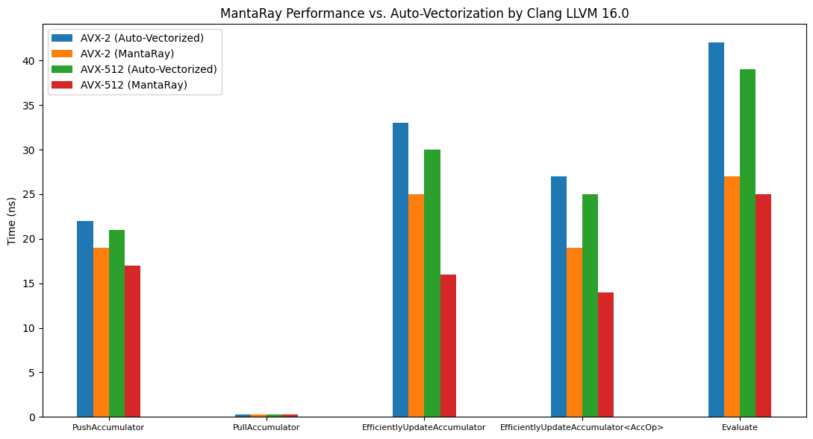

<h1 align="center">
	
</h1>

<h3 align="center">
	MantaRay - Lightspeed C++ Neural Network (UE) Inference Library for Chess
</h3>

---

### Features
- **MantaRay API**: An Object-Oriented API for using neural networks 
in C++, compiled to data-oriented assembly for maximum performance.
- **Handwritten SIMD**: MantaRay uses handwritten SIMD code over the
auto-vectorization of the compiler to achieve maximum performance on
latest hardware.
- **Data Permutation**: MantaRay permutes the weights and biases of the
network to achieve the maximum out of each cache line.

### Installation

**Requirements:**
- CMake 3.14+
- Clang (LLVM 16) - Other versions may deliver suboptimal performance.

**CMake Setup:**
```cmake
# Download CPM.cmake to easily install packages. Skip this step if you
# have already done so.
set(CPM_DOWNLOAD_VERSION 0.38.0)

if(CPM_SOURCE_CACHE)
    set(CPM_DOWNLOAD_LOCATION "${CPM_SOURCE_CACHE}/cpm/CPM_${CPM_DOWNLOAD_VERSION}.cmake")
elseif(DEFINED ENV{CPM_SOURCE_CACHE})
    set(CPM_DOWNLOAD_LOCATION "$ENV{CPM_SOURCE_CACHE}/cpm/CPM_${CPM_DOWNLOAD_VERSION}.cmake")
else()
    set(CPM_DOWNLOAD_LOCATION "${CMAKE_BINARY_DIR}/cmake/CPM_${CPM_DOWNLOAD_VERSION}.cmake")
endif()

if(NOT (EXISTS ${CPM_DOWNLOAD_LOCATION}))
    message(STATUS "Downloading CPM.cmake to ${CPM_DOWNLOAD_LOCATION}")
    file(DOWNLOAD 
            https://github.com/TheLartians/CPM.cmake/releases/download/v${CPM_DOWNLOAD_VERSION}/CPM.cmake
            ${CPM_DOWNLOAD_LOCATION}
            )
endif()

include(${CPM_DOWNLOAD_LOCATION})

# Add MantaRay as a CPM package. 
# This will download the MantaRay library and build it.
# gh:TheBlackPlague/MantaRay#<branch>
CPMAddPackage("gh:TheBlackPlague/MantaRay#master")

# Link to your target (could be library/executable).
target_link_libraries(<your-target> MantaRay)
```

### Usage

MantaRay is designed to be easy to use. The following examples showcase
the basic usage of the library. 

- Defining a network:
```cpp
#include "Perspective/PerspectiveNNUE.h"

// Define the activation function:
// Format: ClippedReLU<Type, Min, Max>
using Activation = MantaRay::ClippedReLU<int16_t, 0, 255>;

// Define the network:
// Format: PerspectiveNetwork<InputType, OutputType, Activation, ...>
//                      <..., InputSize, HiddenSize, OutputSize, ...>
//                      <...,       AccumulatorStackSize,        ...>
//                      <..., Scale, QuantizationFeature, QuantizationOutput>
using NeuralNetwork = MantaRay::PerspectiveNetwork<int16_t, int32_t, Activation, 768, 256, 1, 512, 400, 255, 64>;
```

- Loading a network from the
[Marlinflow](https://github.com/dsekercioglu/marlinflow) format:
```cpp
// Create the input stream:
MantaRay::MarlinflowStream stream("network.json");

// Create & load the network from the stream:
NeuralNetwork network(stream);
```

- Loading Chess starting position into the network 
(done manually, but typically done via loop in engines):
```cpp
// Pawns
for (int sq = 8; sq < 16; sq++) {
    network.EfficientlyUpdateAccumulator<MantaRay::AccumulatorOperation::Activate>(0, 0, sq);
    network.EfficientlyUpdateAccumulator<MantaRay::AccumulatorOperation::Activate>(0, 1, sq ^ 56);
}

// Knights
network.EfficientlyUpdateAccumulator<MantaRay::AccumulatorOperation::Activate>(1, 0, 1);
network.EfficientlyUpdateAccumulator<MantaRay::AccumulatorOperation::Activate>(1, 0, 6);
network.EfficientlyUpdateAccumulator<MantaRay::AccumulatorOperation::Activate>(1, 1, 1 ^ 56);
network.EfficientlyUpdateAccumulator<MantaRay::AccumulatorOperation::Activate>(1, 1, 6 ^ 56);

// Bishops
network.EfficientlyUpdateAccumulator<MantaRay::AccumulatorOperation::Activate>(2, 0, 2);
network.EfficientlyUpdateAccumulator<MantaRay::AccumulatorOperation::Activate>(2, 0, 5);
network.EfficientlyUpdateAccumulator<MantaRay::AccumulatorOperation::Activate>(2, 1, 2 ^ 56);
network.EfficientlyUpdateAccumulator<MantaRay::AccumulatorOperation::Activate>(2, 1, 5 ^ 56);

// Rooks
network.EfficientlyUpdateAccumulator<MantaRay::AccumulatorOperation::Activate>(3, 0, 0);
network.EfficientlyUpdateAccumulator<MantaRay::AccumulatorOperation::Activate>(3, 0, 7);
network.EfficientlyUpdateAccumulator<MantaRay::AccumulatorOperation::Activate>(3, 1, 0 ^ 56);
network.EfficientlyUpdateAccumulator<MantaRay::AccumulatorOperation::Activate>(3, 1, 7 ^ 56);

// Queen
network.EfficientlyUpdateAccumulator<MantaRay::AccumulatorOperation::Activate>(4, 0, 3);
network.EfficientlyUpdateAccumulator<MantaRay::AccumulatorOperation::Activate>(4, 1, 3 ^ 56);

// King
network.EfficientlyUpdateAccumulator<MantaRay::AccumulatorOperation::Activate>(5, 0, 4);
network.EfficientlyUpdateAccumulator<MantaRay::AccumulatorOperation::Activate>(5, 1, 4 ^ 56);
```

- Efficient Accumulator Updates:
```cpp
// Piece: 0-5 (Pawn, Knight, Bishop, Rook, Queen, King)
// Color: 0-1 (White, Black)
// Square: 0-63 (A1-H8)

// Push Accumulator (right before updating for MakeMove):
network.PushAccumulator();

// Pull Accumulator (to undo the updates done after PushAccumulator):
network.PullAccumulator();

// Inserting a piece:
// piece: Piece
// color: Color
// sq   : Square
network.EfficientlyUpdateAccumulator<MantaRay::AccumulatorOperation::Activate  >(piece, color, sq);

// Removing a piece:
// piece: Piece
// color: Color
// sq   : Square
network.EfficientlyUpdateAccumulator<MantaRay::AccumulatorOperation::Deactivate>(piece, color, sq);

// Moving a piece:
// piece: Piece
// color: Color
// from : Square
// to   : Square
network.EfficientlyUpdateAccumulator(piece, color, from, to);
```

- Evaluating the network:
```cpp
// Evaluate when it is white's turn:
int32_t score = network.Evaluate(0);
// Evaluate when it is black's turn:
int32_t score = network.Evaluate(1);
```

- Saving to binary file:
```cpp
// Create the output stream:
MantaRay::BinaryFileStream stream("network.nnue");

// Save the network to the stream:
network.WriteTo(stream);
```

### Benchmarks
Only certain methods have been benchmarked. Other methods
are not benchmarked as they are not used in the evaluation loop, thus,
not performance critical. They should be used only when the network
is being reset (very less frequently).

- PerspectiveNNUE (Intel i9-11900H, Clang LLVM 16, -O3):
